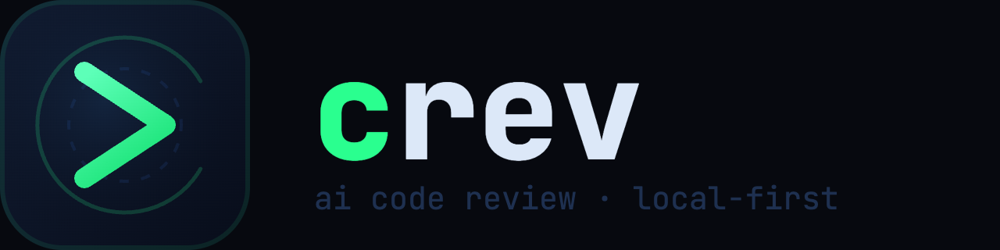

<p align="center">
  
</p>

AI code review from the command line. Runs locally via Ollama or with any cloud LLM.

```
$ crev review --staged
using qwen2.5-coder:14b via Ollama (local)
reviewing 3 files (47 added, 12 removed)
context: Rich (4 types, 6 called fns, 2 tests)

[!] HIGH src/payments/processor.rs:142
    balance + amount can exceed i64::MAX when processing large transfers;
    use checked_add() and return Err on overflow

[~] MED  src/payments/processor.rs:98
    db.execute() result is silently ignored; if the INSERT fails, the caller
    receives a success response while the data was never written

[✓] LGTM src/utils/format.rs — change looks correct

3 findings (1 high, 1 med, 0 low) · 4.2s · qwen2.5-coder:14b
```

---

## Requirements

- A git repository
- One of:
  - [Ollama](https://ollama.ai) running locally (`ollama serve` + `ollama pull qwen2.5-coder:7b`)
  - `ANTHROPIC_API_KEY`, `OPENAI_API_KEY`, or `GEMINI_API_KEY` set

---

## Install

```sh
curl -fsSL https://raw.githubusercontent.com/starc007/crev/main/install.sh | sh
```

Or build from source:

```sh
cargo install --path .
```

---

## Quick start

```sh
# Stage some changes
git add -p

# Review them
crev review --staged

# Use a cloud model instead
crev review --staged --model claude-sonnet-4-6

# Install git hooks so every commit is reviewed automatically
crev init
```

---

## Commands

### `crev review`

Reviews code changes.

```
Options:
  --staged            Review staged changes (default)
  --unstaged          Review unstaged changes
  --commit <HASH>     Review a specific commit
  --commits <RANGE>   Review a commit range  e.g. HEAD~3..HEAD
  --model, -m <MODEL> Model to use (overrides config)
  --json              Output findings as JSON
  --fail-on <SEV>     Exit 1 if any finding at or above this severity [low|med|high]
  --security          Security-focused review mode
  --no-cloud          Never use a cloud LLM
  --path <PATH>       Path to git repo (default: current directory)
```

**Examples**

```sh
crev review --staged
crev review --commit abc1234
crev review --commits main..feature-branch
crev review --staged --model gpt-4o
crev review --staged --model claude-sonnet-4-6
crev review --staged --fail-on=high    # blocks git hooks on HIGH findings
crev review --staged --json            # machine-readable output
crev review --staged --security        # security-only scan
```

### `crev init`

Installs git hooks and creates a `.reviewrc` config in the repo root.

```sh
crev init              # install hooks + create .reviewrc
crev init --dry-run    # preview what would be installed
crev init --force      # overwrite existing hooks
crev init --hooks-only # skip .reviewrc creation
crev init --uninstall  # remove hooks
crev init --ci         # print a GitHub Actions workflow to stdout
```

Installs two hooks:
- **pre-commit**: reviews staged changes before every commit
- **pre-push**: reviews all unpushed commits only when pushing more than one — single commits are already covered by pre-commit

### `crev history`

Shows review history stored in a local SQLite database.

```sh
crev history              # last 10 reviews
crev history --patterns   # recurring findings (3+ times in 30 days)
crev history --clear      # delete history for this repo
```

History is stored at `~/Library/Application Support/crev/history.db` on macOS and `~/.local/share/crev/history.db` on Linux.

### `crev config`

```sh
crev config --show    # print effective config for current directory
crev config --init    # create ~/.config/crev/config.toml with defaults
```

---

## Models and backends

crev supports four backends. The backend is auto-selected based on what's available.

### Auto-detection order

1. Ollama running locally → use Ollama
2. `ANTHROPIC_API_KEY` set → use Anthropic
3. `OPENAI_API_KEY` set → use OpenAI
4. `GEMINI_API_KEY` / `GOOGLE_API_KEY` set → use Gemini

### Selecting a model

The `--model` flag infers the backend from the model name:

```sh
# Ollama (local)
crev review --model qwen2.5-coder:14b
crev review --model deepseek-coder-v2:16b

# Anthropic
crev review --model claude-sonnet-4-6
crev review --model claude-opus-4-6

# OpenAI
crev review --model gpt-4o
crev review --model o3

# Gemini
crev review --model gemini-1.5-pro
```

### API keys

```sh
export ANTHROPIC_API_KEY=sk-ant-...
export OPENAI_API_KEY=sk-...
export GEMINI_API_KEY=...        # or GOOGLE_API_KEY
```

### OpenAI-compatible endpoints

Any OpenAI-compatible API (Groq, Together, local vLLM, etc.) works via `OPENAI_BASE_URL`:

```sh
export OPENAI_API_KEY=your-key
export OPENAI_BASE_URL=https://api.groq.com
crev review --model llama-3.1-70b-versatile
```

### Ollama local models

crev picks the best available Ollama model automatically:

| Model | Min RAM | Quality |
|---|---|---|
| `qwen2.5-coder:14b` | 16 GB | ★★★★★ |
| `qwen2.5-coder:7b` | 8 GB | ★★★★☆ |
| `deepseek-coder-v2:16b` | 16 GB | ★★★★★ |
| `codellama:13b` | 8 GB | ★★★★☆ |
| `llama3:8b` | 8 GB | ★★★☆☆ |

Set `OLLAMA_HOST` to point at a remote Ollama instance.

---

## Configuration

`crev init` creates `.reviewrc` in your repo root. Commit it to share settings with your team.

```toml
[review]
# model = "qwen2.5-coder:14b"   # override auto-detected model
# backend = "anthropic"          # ollama | anthropic | openai | gemini
# api_key_env = "MY_API_KEY"     # env var to read the API key from (default per-backend)
max_tokens = 32000
severity_threshold = "low"      # low | med | high

[privacy]
strip_comments = false           # remove comments before sending to LLM
strip_strings = false            # replace string literals with <REDACTED>

[ignore]
paths = [
  "migrations/",
  "*.generated.rs",
  "vendor/",
  "*.pb.go",
]

[[rules]]
name = "no-raw-sql"
description = "All DB queries must use QueryBuilder, never raw SQL strings"

[[rules]]
name = "no-unwrap"
description = "Never use .unwrap() in non-test code — use ? or expect()"
```

Personal defaults (model choice, API keys) go in `~/.config/crev/config.toml` — this file is never committed.

**Config lookup order:** `.reviewrc` (current dir → upward) → `~/.config/crev/config.toml` → built-in defaults.


## Output formats

### Terminal (default)

A spinner shows while the model analyzes. Each finding streams to the terminal as soon as its line is complete:

```
⠴ analyzing...

[!] HIGH src/payments/processor.rs:142
    balance + amount can exceed i64::MAX — use checked_add()

[~] MED  src/auth/session.rs:67
    session token written to log at info level — strip before logging

[i] LOW  src/utils/retry.rs:23
    fixed sleep of 1000ms; use exponential backoff to avoid thundering herd

3 findings (1 high, 1 med, 1 low) · 4.2s · qwen2.5-coder:14b
```

### JSON (`--json`)

```json
{
  "findings": [
    {
      "severity": "High",
      "file": "src/payments/processor.rs",
      "line": 142,
      "message": "balance + amount can exceed i64::MAX — use checked_add()"
    }
  ],
  "github_annotations": [
    {
      "path": "src/payments/processor.rs",
      "start_line": 142,
      "end_line": 142,
      "annotation_level": "failure",
      "message": "balance + amount can exceed i64::MAX — use checked_add()"
    }
  ]
}
```

`github_annotations` is compatible with the [GitHub Check Runs API](https://docs.github.com/en/rest/checks/runs) and appears as inline comments on PR diffs.

---

## CI / GitHub Actions

Get a ready-to-use workflow with one command:

```sh
crev init --ci > .github/workflows/crev.yml
```

Then add your API key as a GitHub secret: **repo → Settings → Secrets and variables → Actions → New repository secret** → `ANTHROPIC_API_KEY`.

On every PR open or push, crev will:
1. Review the diff between your branch and `main`
2. Post each finding as an **inline comment on the PR diff**
3. Post a summary comment on the PR thread
4. **Block merge** if any HIGH findings exist

The generated workflow looks like:

```yaml
name: crev code review
on:
  pull_request:
    types: [opened, synchronize]
jobs:
  review:
    runs-on: ubuntu-latest
    permissions:
      pull-requests: write
    steps:
      - uses: actions/checkout@v4
        with:
          fetch-depth: 0
      - name: Install crev
        run: curl -fsSL https://raw.githubusercontent.com/starc007/crev/main/install.sh | sh
      - name: Run crev review
        env:
          ANTHROPIC_API_KEY: ${{ secrets.ANTHROPIC_API_KEY }}
        run: |
          crev review \
            --commits ${{ github.event.pull_request.base.sha }}..${{ github.sha }} \
            --model claude-sonnet-4-5 \
            --json > findings.json
      # ... posts inline annotations + PR comment, fails on HIGH
```

To use OpenAI instead: set `OPENAI_API_KEY` as the secret and change `--model` to `gpt-4o`.

---

## Pattern detection

crev tracks every review in a local SQLite database. After the same finding appears 3+ times in a 30-day window, it warns you before the next review:

```
⚠ Recurring pattern detected (5x in 30 days):
  integer overflow in arithmetic operations
```

This surfaces systemic issues that keep slipping through code review.

---

## License

HEHEHEHEHE
